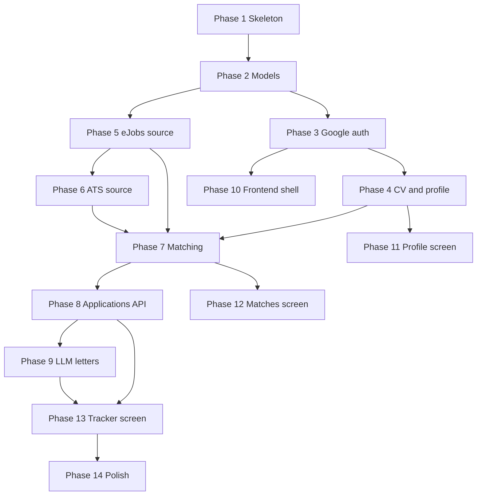

# CV Applier - Build Plan

Execution checklist for [PLAN.md](PLAN.md). Work proceeds one phase at a time; each phase
ends with something you can run and check. Live status for every phase is tracked in
[PROGRESS.md](PROGRESS.md) - check there for where the build currently stands.

Conventions used below:

- **Files** - what gets created or changed in that phase.
- **Verify** - the command or click-path that proves the phase works.
- **Done when** - the observable result to look for before moving on.

---

## Prerequisites

Before phase 3 (auth) you need a Google OAuth client. Everything else can proceed without it.

1. Google Cloud Console, create or pick a project.
2. APIs and Services, OAuth consent screen: External, add yourself as a test user.
3. Credentials, Create credentials, OAuth client ID, type Web application.
4. Authorised redirect URI: `http://localhost:8000/api/auth/google/callback`
5. Copy the client ID and secret into `backend/.env`.

An LLM key is optional. Without it, CV parsing falls back to keyword extraction and the
cover letter button is disabled with an explanatory message.

`backend/.env`:

```
DATABASE_URL=sqlite:///./cv_applier.db
JWT_SECRET=<random 32+ chars>
FRONTEND_ORIGIN=http://localhost:5173
GOOGLE_CLIENT_ID=
GOOGLE_CLIENT_SECRET=
GOOGLE_REDIRECT_URI=http://localhost:8000/api/auth/google/callback
OPENAI_API_KEY=
OPENAI_BASE_URL=https://api.openai.com/v1
OPENAI_MODEL=gpt-4o-mini
```

---

## Phase dependencies



Phases 5 and 6 do not depend on auth, so the job pipeline can be proven early and
independently if you would rather see results before building screens.

---

# Part 1 - Backend foundation

## Phase 1. Application skeleton

**Goal** - a server that boots, serves docs, and talks to the frontend origin.

**Files** - `backend/app/main.py`, edit `backend/app/config.py`, add `backend/.env.example`,
add `.gitignore`.

Details: FastAPI app with CORS restricted to `FRONTEND_ORIGIN` and `allow_credentials=True`
(required for the session cookie), a `GET /api/health` route, and table creation on
startup via `Base.metadata.create_all`. Config gains the Google and frontend settings
listed above and drops nothing yet.

No Alembic. SQLite plus `create_all` is right for a single-developer project; migrations
become worth it when someone else runs the app.

**Verify** - `uvicorn app.main:app --reload` then `curl localhost:8000/api/health`

**Done when** - health returns 200 and `/docs` lists the route.

Effort: 30 minutes.

---

## Phase 2. Data model for identity

**Goal** - tables that match the auth design.

**Files** - edit `backend/app/models.py`, edit `backend/requirements.txt`.

Changes: remove `password_hash` from `User`, add `name`, `avatar_url` and `last_login_at`.
Add the `Identity` model:

```python
class Identity(Base):
    __tablename__ = "identities"
    __table_args__ = (UniqueConstraint("provider", "subject", name="uq_identity_provider_subject"),)

    id: Mapped[int] = mapped_column(primary_key=True)
    user_id: Mapped[int] = mapped_column(ForeignKey("users.id"), index=True)
    provider: Mapped[str] = mapped_column(String(32))
    subject: Mapped[str] = mapped_column(String(255))
    created_at: Mapped[datetime] = mapped_column(DateTime, default=utcnow)
```

Drop `bcrypt` from requirements. Delete any existing `cv_applier.db` rather than
migrating, since there is no real data yet.

**Verify** - `python -c "from app.db import Base, engine; Base.metadata.create_all(engine)"`
then inspect with `sqlite3 cv_applier.db ".schema identities"`

**Done when** - the schema prints with the unique constraint present.

Effort: 20 minutes.

---

## Phase 3. Google sign-in

**Goal** - a real Google login that ends with a session cookie.

**Files** - `backend/app/oauth.py`, `backend/app/session.py`, `backend/app/routers/auth.py`.

`oauth.py` holds the provider registry and the flow mechanics:

```python
@dataclass(frozen=True)
class Provider:
    name: str
    auth_url: str
    token_url: str
    userinfo_url: str
    scopes: str
    client_id: str
    client_secret: str

    def identity_from(self, claims: dict) -> ExternalIdentity: ...


PROVIDERS = {"google": Provider(...)}
```

Flow specifics:

- `/login` builds the authorization URL with `state` and `code_challenge` (S256), and
  stores `state` plus the PKCE verifier in a signed cookie with a five minute expiry.
- `/callback` rejects a mismatched or missing `state` before doing anything else,
  exchanges the code, then reads `sub`, `email`, `email_verified`, `name`, `picture`
  from userinfo.
- Find identity by `(provider, sub)`. If absent and a user with that email exists and
  `email_verified` is true, link a new identity to it. If absent otherwise, create user,
  identity and an empty profile in one transaction.
- Google tokens are used and discarded, never persisted.

`session.py` holds `create_session_token`, the cookie name and flags
(httpOnly, SameSite=Lax, Secure off for localhost), and the `current_user` dependency.

**Verify** - open `http://localhost:8000/api/auth/google/login` in a browser, complete
Google, then `curl -b cookies.txt localhost:8000/api/auth/me`

**Done when** - `me` returns your email, and a second sign-in reuses the same user row
rather than creating a duplicate.

Effort: 2 hours, most of it Google Console setup and redirect URI typos.

---

## Phase 4. CV upload and profile

**Goal** - upload a real CV and get an editable structured profile.

**Files** - `backend/app/cv.py`, `backend/app/llm.py` (extraction only),
`backend/app/routers/profile.py`, `backend/app/schemas.py`.

Details: `cv.py` dispatches on file extension, `pdfplumber` for PDF and `python-docx` for
DOCX, returning plain text; reject anything else with a 400. `llm.py` sends the text with
a JSON-schema-shaped prompt and parses the response into profile fields, falling back to
keyword extraction against a skills list when no key is configured. `PATCH /api/profile`
accepts corrections to every extracted field plus the search preferences.

Guard rails worth having: cap upload size at about 5 MB, and truncate CV text before the
LLM call so a 40 page CV cannot blow the context window.

**Verify** - upload your own CV in both formats through `/docs`, then `GET /api/profile`

**Done when** - skills and titles come back recognisably correct, and a `PATCH` sticks.

Effort: 2 hours.

---

## Phase 5. eJobs source

**Goal** - real Romanian postings in the database.

**Files** - `backend/app/sources/base.py`, `backend/app/sources/ejobs.py`,
`backend/app/sources/registry.py`, `backend/app/routers/jobs.py`.

Details: `base.py` carries the `Posting` dataclass and `JobSource` protocol from
[PLAN.md](PLAN.md) section 6. `ejobs.py` does discovery from the category sitemaps plus
`rss-listings.xml`, filters to URLs not already in `jobs`, then fetches each detail page
and extracts the `JobPosting` node from the JSON-LD `@graph`. One second between requests,
identifying User-Agent, and a hard cap on pages per run so a first run cannot spider the
whole site.

Romanian remote detection: check `jobLocationType` first, then look for "remote",
"de acasa", "telemunca" and "hibrid" in the title and description, on diacritic-normalised
text.

`POST /api/jobs/refresh` runs the enabled sources and upserts on `(source, external_id)`.

**Verify** - `POST /api/jobs/refresh`, then
`sqlite3 cv_applier.db "select company, title, locations from jobs limit 10"`

**Done when** - ten real listings with populated company, location and description.

Effort: 3 hours. This is the phase most likely to need iteration on parsing.

---

## Phase 6. ATS source and coverage check

**Goal** - ATS boards wired in, and an honest answer on whether they help for Romania.

**Files** - `backend/app/sources/ats.py`, `backend/app/sources/companies.py`.

Details: one fetcher with three response mappings.

- Greenhouse: `boards-api.greenhouse.io/v1/boards/{slug}/jobs?content=true`
- Lever: `api.lever.co/v0/postings/{slug}?mode=json`
- Ashby: `api.ashbyhq.com/posting-api/job-board/{slug}`

`companies.py` is a plain list of `(provider, slug)` pairs. Seed it with known-good slugs
(`stripe`, `databricks`, `gitlab`, `figma`, `coinbase` on Greenhouse) plus any Romanian
employers found while building.

Before going further, count how many fetched roles are Romania-eligible, meaning located
in Romania or genuinely remote-EU. Write the number in this file. If it is negligible,
mark ATS as secondary and move BestJobs from phase 2 into scope.

**Verify** - `POST /api/jobs/refresh`, then group by source and count Romania-eligible rows.

**Done when** - the count exists and the decision is recorded.

Effort: 2 hours including the measurement.

---

## Phase 7. Matching

**Goal** - ranked matches with a readable reason.

**Files** - `backend/app/matching.py`, extend `backend/app/routers/jobs.py`.

Details: normalise text (lowercase, strip diacritics), apply the hard filters, then score
title overlap, skills overlap and recency into 0 to 100. Build the reason string from the
actual matched skills. Keep the small Romanian/English synonym map beside the scorer.

This is pure functions over plain data, so it is the one part worth unit testing: a
handful of fabricated postings asserting order and filter behaviour.

**Verify** - `GET /api/matches` after phases 4 and 5

**Done when** - the top results are plausibly yours, and every result carries a reason.

Effort: 2 hours.

---

## Phase 8. Applications API

**Goal** - the review queue as data.

**Files** - `backend/app/routers/applications.py`.

Details: create from a match (guarding the `(user, job)` uniqueness), list filtered by
status, patch status, notes and letter. Validate status transitions against the lifecycle
in [PLAN.md](PLAN.md) section 4 and stamp `submitted_at` when entering `submitted`.

**Verify** - create, patch through to `submitted`, list by status

**Done when** - an invalid transition is rejected and `submitted_at` is set exactly once.

Effort: 1 hour.

---

## Phase 9. Cover letters

**Goal** - a draft worth editing rather than rewriting.

**Files** - extend `backend/app/llm.py`, extend the applications router.

Details: `draft_cover_letter(profile, job)` gets the profile summary, the matched skills
and the job description, and is told to write in the language of the posting, which
matters on eJobs where half the listings are Romanian. Store on the application and move
status to `drafted`. Return a clear error when no key is configured rather than failing
silently.

**Verify** - draft a letter for a real eJobs match and read it

**Done when** - the letter names the company and role and reads like your CV, not a template.

Effort: 1 hour.

---

# Part 2 - Frontend

## Phase 10. Shell and sign-in

**Files** - Vite scaffold in `frontend/`, `src/api.ts`, `src/pages/SignIn.tsx`,
router with a protected-route wrapper.

Details: Vite proxy for `/api` to port 8000 so cookies are same-origin in development.
`api.ts` is a thin `fetch` wrapper with `credentials: "include"` that redirects to sign-in
on a 401. The sign-in page is one button linking to `/api/auth/google/login`.

**Verify** - `npm run dev`, click through Google, land back in the app authenticated.

**Done when** - a reload keeps you signed in and logout clears it.

Effort: 2 hours including Tailwind and TanStack Query setup.

---

## Phase 11. Profile screen

**Files** - `src/pages/Profile.tsx`, upload component, preferences form.

Details: drag-and-drop or file picker limited to `.pdf` and `.docx`, a parsing spinner
(the LLM call takes a few seconds), then editable chips for skills and titles and plain
inputs for the preferences. Save issues the `PATCH`.

**Done when** - you can fix a wrongly extracted skill and see it persist across reload.

Effort: 3 hours.

---

## Phase 12. Matches screen

**Files** - `src/pages/Matches.tsx`, match card component.

Details: a "Refresh jobs" button that calls the refresh endpoint and shows progress, then
ranked cards with score, reason, company, location, posted date, a link to the original
posting, and two actions: save to applications, or dismiss. Filter controls for remote
only and minimum score.

**Done when** - refreshing brings in new eJobs listings and saving one creates a row in
the tracker.

Effort: 3 hours.

---

## Phase 13. Tracker screen

**Files** - `src/pages/Applications.tsx`, status badge, letter editor drawer.

Details: table grouped by status with counts, a drawer to read and edit the cover letter
with a copy button, a notes field, and the status control. The apply link and the
"I submitted this" confirmation sit next to each other, since that pairing is the actual
workflow.

**Done when** - you can take one job from match to submitted and later mark it as an
interview.

Effort: 3 hours.

---

## Phase 14. Polish

**Files** - across both apps, plus `README.md`.

Details: empty states that explain the next action, error toasts, loading skeletons, and
a README covering setup, the Google OAuth steps and how to run both halves. Re-read the
diff against [.cursor/rules/coding-style.mdc](.cursor/rules/coding-style.mdc) and strip
any comment that restates its code.

Effort: 2 hours.

---

## Documentation deliverables

Each phase ships its doc in the same change as its code, per the docs rule. Written for an
agent with no prior context: what the subsystem does, where it lives, the contract it
exposes, and the constraints the code cannot show.

- Phase 1: `AGENTS.md` at the root - stack, how to run both halves, index into `docs/`.
- Phase 3: `docs/auth.md` - the OAuth flow, why no Google tokens are stored, the verified
  email rule for account linking, and how to add a second provider.
- Phase 4: `docs/profile.md` - CV parsing path, LLM extraction contract, the fallback when
  no key is present.
- Phases 5 and 6: `docs/sources.md` - the `JobSource` contract, one section per adapter,
  the politeness rules, and the Romania coverage finding from phase 6.
- Phase 7: `docs/matching.md` - the scoring formula, the hard filters, the bilingual
  normalisation.
- Phase 9: `docs/llm.md` - the two prompts, the provider configuration, the language rule.
- Phase 10: `docs/frontend.md` - routing, the API wrapper, the auth redirect behaviour.

## Parallel work and subagents

Per the feature workflow rule, the lead fixes the contracts first, then splits. Three
points in this plan split cleanly:

- Phases 5 and 6 are one workstream (job sources) that is independent of phases 3 and 4
  (auth and profile). Contract to fix first: the `Posting` dataclass and `JobSource`
  protocol in `backend/app/sources/base.py`.
- Phases 11, 12 and 13 are three independent screens once the API exists. Contract to fix
  first: the response shapes in `src/api.ts` and the shared components each screen may
  use. Each subagent owns its own page file and nothing else.
- Phase 14 polish is not parallelisable and stays with the lead.

Everything else is sequential because each phase consumes the previous one's output.

## Totals and sequencing

Part 1 is roughly 13 hours, part 2 roughly 13 hours. The first moment the project is
genuinely useful is the end of phase 9, when you can get a ranked list and a drafted
letter through `/docs` without any UI. If you want that sooner, phases 5 and 7 can be
pulled ahead of phase 3 and run against a hardcoded profile.

## Deferred, with triggers

- BestJobs adapter - when phase 6 shows ATS contributes little for Romania.
- JSearch key - when you want LinkedIn and Indeed listings in the results.
- Scheduled refresh - when manual refresh becomes annoying, likely after a week of use.
- Playwright auto-fill for ATS forms - after the tracker proves the workflow.
