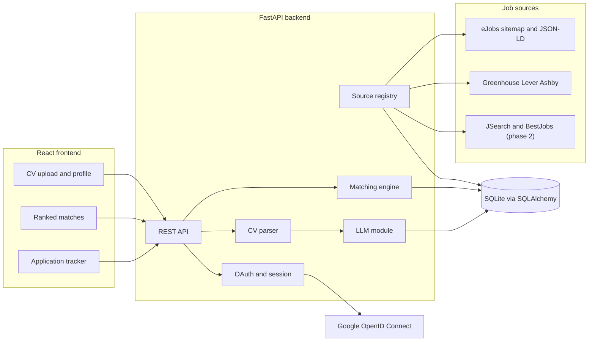
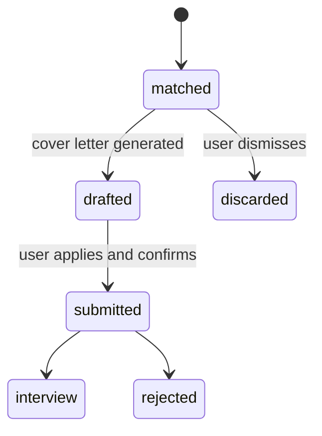
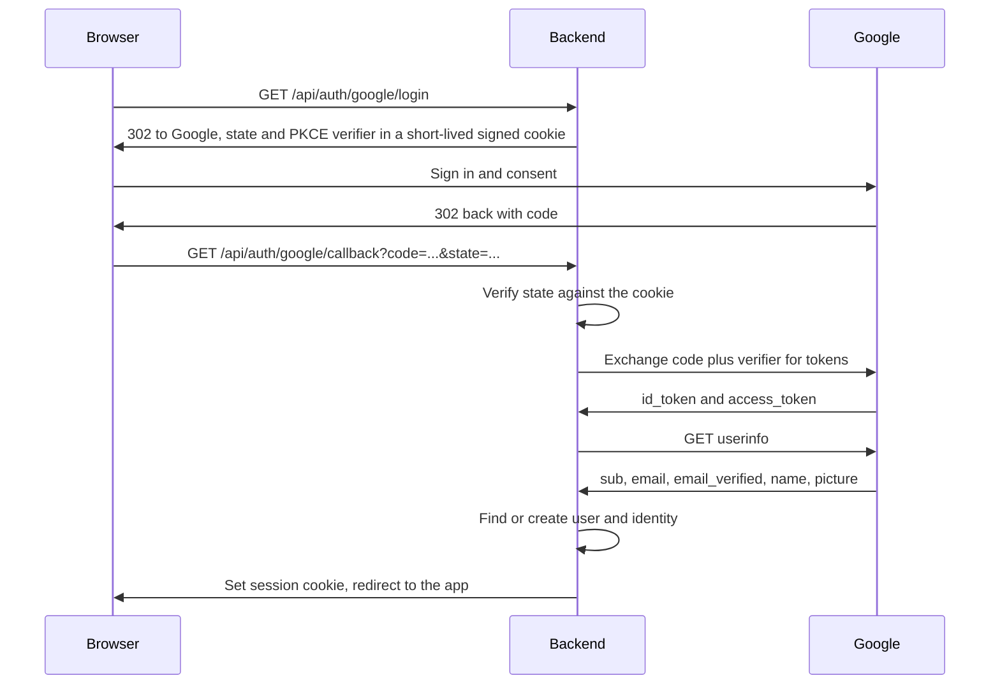

# CV Applier - v1 Plan

A web app that reads your CV, finds matching job openings for the Romanian market,
drafts tailored cover letters, and tracks every application you submit.

Status: backend skeleton and identity tables exist; see [Current state](#current-state).
The phase-by-phase execution checklist lives in [BUILD.md](BUILD.md); live status for
each phase is tracked in [PROGRESS.md](PROGRESS.md).

---

## 1. Scope

### In scope for v1

- Sign in with Google (OpenID Connect), with the provider layer shaped so GitHub or
  LinkedIn sign-in can be added later without reworking auth.
- CV upload in PDF and DOCX, parsed into a structured profile you can correct by hand.
- Search preferences: location, remote-only, minimum salary, extra keywords.
- Job collection from sources that publish machine-readable data (eJobs plus ATS boards).
- Deterministic ranking of postings against your profile, with a readable reason per match.
- LLM-drafted cover letter per application, editable before use.
- Application tracker: matched, drafted, submitted, interview, rejected, discarded.

### Explicitly out of scope for v1

- Automatic submission of applications. Nothing reaches `submitted` without your click.
- Browser automation (Playwright) and any storage of third-party logins.
- Passwords. There is no password field anywhere, so there is nothing to leak or reset.
- Paid APIs. The only key needed is an LLM key, and the app degrades gracefully without it.
- LinkedIn and Indeed listings (see below for why, and when they arrive).

---

## 2. Evidence base

All of the following was verified live against the real endpoints, not assumed.

| Source | Status | What we get |
| --- | --- | --- |
| eJobs.ro | Works. Primary source | RSS and per-category sitemaps listed in its own `robots.txt`; every job page carries a full schema.org `JobPosting` in JSON-LD |
| Greenhouse | Works | `boards-api.greenhouse.io/v1/boards/{slug}/jobs` returned 632 jobs for Stripe, 891 for Databricks |
| Ashby | Works | `api.ashbyhq.com/posting-api/job-board/{slug}` returned 145 jobs with `applyUrl`, `isRemote`, `location`, `descriptionPlain` |
| Lever | Works | `api.lever.co/v0/postings/{slug}?mode=json` confirmed against `leverdemo` |
| BestJobs.eu | Phase 2 | `robots.txt` permits generic crawlers and sitemaps are published, but there is no JSON-LD; data sits in a Next.js payload, so parsing is more brittle |
| JSearch (RapidAPI) | Phase 2 | Needs a key. This is how LinkedIn and Indeed listings eventually reach us, via Google for Jobs aggregation |
| LinkedIn, Indeed (direct) | Not viable | Their APIs are partner-gated and employer-side only. Scraping them means bot detection and account risk |

Sample of the JSON-LD pulled from a live eJobs listing:

```json
{
  "title": "Area Sales Representative - Scule aschiere",
  "datePosted": "2026-09-15T11:44:26Z",
  "validThrough": "2026-10-15T00:00:00+03:00",
  "employmentType": ["FULL_TIME"],
  "hiringOrganization": { "name": "ManpowerGroup Romania" },
  "jobLocation": [{ "address": { "addressLocality": "Cluj-Napoca", "addressCountry": "RO" } }],
  "experienceRequirements": "...",
  "description": "1518 chars"
}
```

### Open question to settle early

UiPath and Bitdefender are **not** on Greenhouse or Lever. The ATS boards will likely
contribute remote-friendly roles at global companies rather than local Bucharest jobs.
First implementation phase for that adapter is to measure how many Romania-eligible roles
it actually yields. If the answer is near zero, deprioritise ATS and pull BestJobs forward.
eJobs carries v1 either way.

---

## 3. Architecture



Stack: FastAPI, SQLAlchemy and SQLite on the backend; Vite, React, TypeScript and
Tailwind on the frontend. SQLite is behind `DATABASE_URL`, so moving to Postgres later
is a config change rather than a rewrite.

---

## 4. Data model

Defined in [backend/app/models.py](backend/app/models.py).

- `users` - identity-independent account: email, display name, avatar URL, timestamps.
  No password column.
- `identities` - one row per external login linked to a user: `provider`, `subject`
  (the provider's stable user id), unique on `(provider, subject)`. This is what lets
  GitHub or LinkedIn sign-in be added later without touching `users`.
- `profiles` - one row per user, holding both the CV-derived fields (titles, skills,
  years of experience, summary) and the search preferences (preferred locations,
  remote-only, minimum salary). One table because there is exactly one of each per user.
- `jobs` - shared cache of postings, unique on `(source, external_id)`, so two users
  searching the same day do not trigger a refetch.
- `applications` - the join between a user and a job. This is where the review queue lives,
  carrying status, score, match reason, cover letter, notes and timestamps.

### Application lifecycle



The transition to `submitted` is only ever triggered by an explicit user action. This is
the core design commitment of the product.

---

## 5. Authentication

Google sign-in over OpenID Connect, using the authorization code flow with PKCE. The
endpoints below come from Google's live discovery document, checked today:

- Authorization: `https://accounts.google.com/o/oauth2/v2/auth`
- Token: `https://oauth2.googleapis.com/token`
- Userinfo: `https://openidconnect.googleapis.com/v1/userinfo`
- Scopes: `openid email profile`, and `code_challenge_method=S256` is supported



Design notes:

- No Google tokens are stored. We need Google only to establish who you are at login;
  afterwards the app runs on its own session cookie, so there is nothing long-lived to
  protect or refresh.
- The session is our own JWT in an httpOnly, SameSite=Lax cookie, signed with `JWT_SECRET`.
- `state` and the PKCE verifier live in a short-lived signed cookie rather than a
  server-side session store, which keeps the backend stateless.
- Provider extensibility is a dict of provider configs plus a claim-mapping function, so
  adding GitHub is a new entry and a small mapper, not a new auth system.
- Account linking: if a login arrives for an email that already exists, we attach a new
  identity row to that user, but only when the provider reports the email as verified.
  Linking on an unverified email is an account-takeover path.
- Dependency effect: `bcrypt` comes out of the requirements, and nothing new goes in;
  `httpx` and `pyjwt` are already there.

Local setup needed from you: a Google Cloud OAuth client (Web application) with redirect
URI `http://localhost:8000/api/auth/google/callback`, providing `GOOGLE_CLIENT_ID` and
`GOOGLE_CLIENT_SECRET`.

One clarification, since the names collide: LinkedIn sign-in is OpenID Connect and is
perfectly allowed. It has nothing to do with LinkedIn's jobs API, and adding it would not
give us access to a single job posting.

---

## 6. Job sources

Every source implements one small interface, so adding BestJobs or JSearch later means
one new file and a registry entry.

```python
@dataclass
class Posting:
    source: str
    external_id: str
    url: str
    apply_url: str
    title: str
    company: str
    locations: list[str]
    remote: bool
    employment_type: str
    description: str
    posted_at: datetime | None


class JobSource(Protocol):
    name: str
    def fetch(self, profile: Profile, limit: int) -> list[Posting]: ...
```

### eJobs adapter

- Discovery: category sitemaps such as `sitemap-listings-it-software.xml` and
  `sitemap-listings-internet-ecommerce.xml`, chosen from the profile, plus
  `rss-listings.xml` for freshness.
- Detail: fetch the page, parse the JSON-LD `@graph`, take the `JobPosting` node.
- Field mapping: `title`, `description`, `employmentType`, `hiringOrganization.name`,
  `jobLocation[].address.addressLocality`, `datePosted`, `validThrough`.
- Politeness: one request per second, identifying User-Agent, and a seen-URL set so each
  run only fetches pages it has not seen.
- Remote detection needs Romanian keywords as well as English: listings say "de acasa"
  and "telemunca" as often as "remote".

### ATS adapter

One generic fetcher with three response mappings, driven by a watchlist of
`(provider, slug)` pairs in a config file. Ashby returns the cleanest data of the three,
including a direct `applyUrl`.

---

## 7. CV parsing and profile

`pdfplumber` for PDF and `python-docx` for DOCX, both producing plain text into
`profiles.cv_text`. That text goes through one LLM call returning structured JSON: name,
headline, titles, skills, years of experience, summary.

Without an LLM key the app still runs, falling back to matching the CV text against a
skills keyword list, just less accurately.

The parsed profile is fully editable in the UI. LLM extraction will get things wrong, and
the fix is letting you correct it rather than engineering around it.

---

## 8. Matching

Deterministic scoring with no LLM cost per posting, so a run over thousands of jobs is
free and instant.

1. Hard filters: location must intersect your preferred locations or the job must be
   remote, and the posting must not be expired.
2. Score from 0 to 100: title overlap against your known titles, skills overlap against
   the description, and a recency boost.
3. Every match stores a readable reason, for example "matches 7 of your skills: Python,
   FastAPI, Docker...", so the ranking is never a black box.

Text is normalised for Romanian diacritics, and a small synonym map handles the bilingual
reality of the market, where the same role is posted as "Dezvoltator" or "Developer".

---

## 9. LLM module

One module, `llm.py`, with two functions: `extract_profile(cv_text)` and
`draft_cover_letter(profile, job)`. Provider, base URL and model come from config and it
speaks the OpenAI-compatible protocol, which covers OpenAI, OpenRouter and local models.
Adding Anthropic later is one branch in that file and nothing else.

---

## 10. API surface

| Method and path | Purpose |
| --- | --- |
| `GET /api/auth/{provider}/login` | Redirect to the provider (v1: `google`) |
| `GET /api/auth/{provider}/callback` | Verify state, exchange code, set session cookie |
| `GET /api/auth/me` | Current user, or 401 |
| `POST /api/auth/logout` | Clear the session cookie |
| `GET`, `PATCH /api/profile` | Read and correct the parsed profile and preferences |
| `POST /api/profile/cv` | Upload PDF or DOCX, parse, populate profile |
| `POST /api/jobs/refresh` | Run the enabled sources, upsert into `jobs` |
| `GET /api/matches` | Ranked matches with score and reason |
| `POST /api/applications` | Create from a match, optionally drafting the letter |
| `PATCH /api/applications/{id}` | Edit letter, change status, add notes |
| `GET /api/applications` | The tracker, filterable by status |

---

## 11. Frontend

Vite with React and TypeScript, Tailwind for styling, TanStack Query for server state,
React Router for navigation. Four screens:

- Sign in: a single "Continue with Google" button.
- Profile: CV upload, editable parsed fields, search preferences.
- Matches: ranked cards showing score and reason, with draft-letter and dismiss actions.
- Tracker: table grouped by status, with notes and dates.

No component library. A handful of hand-rolled Tailwind components is less machinery than
wiring up a generator, consistent with
[.cursor/rules/coding-style.mdc](.cursor/rules/coding-style.mdc).

---

## 12. Repository layout

```
backend/
  requirements.txt              exists, drop bcrypt
  app/
    config.py  db.py            exist
    models.py                   users and identities match the auth design
    main.py  session.py  oauth.py  llm.py  matching.py  cv.py
    sources/base.py  ejobs.py  ats.py  registry.py
    routers/auth.py  profile.py  jobs.py  applications.py
frontend/
  src/pages/  src/components/  src/api.ts
```

---

## 13. Build order

Each phase leaves something runnable. The granular version, with verification steps for
each item, is in [BUILD.md](BUILD.md); check [PROGRESS.md](PROGRESS.md) for current status.

1. Backend skeleton: `main.py`, config, database bootstrap.
2. Auth: users and identities tables, Google OAuth flow, session cookie.
3. CV upload and parsing into the profile, with the editable-profile endpoints.
4. eJobs adapter, validated by pulling live IT listings end to end.
5. ATS adapter, plus the Romania-coverage measurement described in section 2.
6. Matching engine and the applications API.
7. LLM module and cover letter drafting.
8. React UI across the four screens.

Rough effort: about a day and a half for the backend, about a day for the frontend.

---

## 14. Current state

- [backend/app/main.py](backend/app/main.py) - FastAPI app, CORS, `/api/health`,
  `create_all` on startup.
- [backend/app/config.py](backend/app/config.py) - settings from environment, including
  Google and frontend origin.
- [backend/app/db.py](backend/app/db.py) - SQLAlchemy engine and session.
- [backend/app/session.py](backend/app/session.py) and
  [backend/app/oauth.py](backend/app/oauth.py) - Google OpenID Connect with PKCE and
  a JWT session cookie. See [docs/auth.md](docs/auth.md).
- [backend/app/models.py](backend/app/models.py) - tables as in section 4. `users` has
  no password column. `identities` is unique on `(provider, subject)`.
- [backend/requirements.txt](backend/requirements.txt) - `bcrypt` removed.

CV parsing, sources, matching, and the frontend are not built yet.

---

## 15. Risks and later phases

- eJobs could change its markup. JSON-LD is the most stable part of any job page because
  Google consumes it, and any breakage is confined to one adapter.
- Politeness matters. This is personal-scale usage at one request per second. If it ever
  became a hosted product, the sourcing question reopens.
- Without JSearch, LinkedIn and Indeed listings will not appear in v1.
- Google OAuth in "testing" mode limits sign-in to test users you list. Publishing the
  consent screen is a separate step if other people will use this.

Later phases, in the order they make sense:

1. BestJobs adapter, and scheduled background refresh of sources.
2. JSearch key, bringing LinkedIn and Indeed listings into the results.
3. Playwright auto-fill for ATS forms, which need no login, keeping the confirm step.
4. Anything touching LinkedIn Easy Apply would have to be a browser extension running in
   your own session, never server-side, and carries account-restriction risk.
