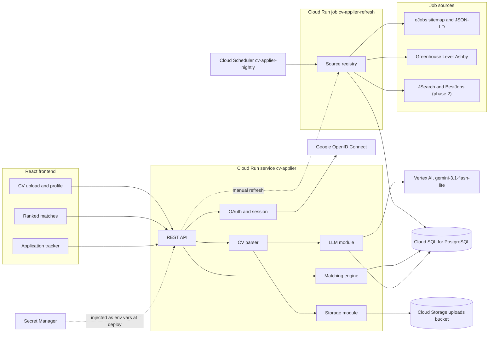
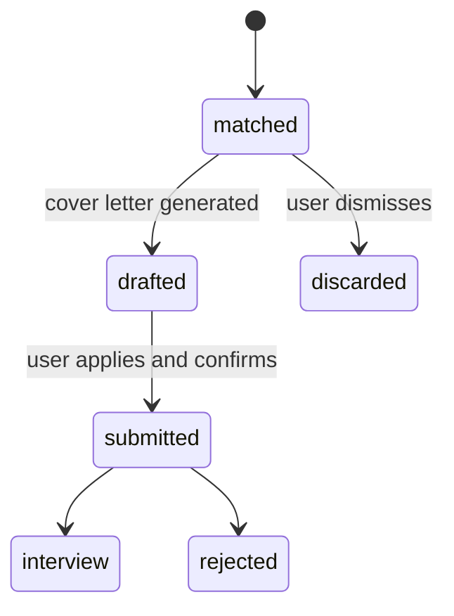
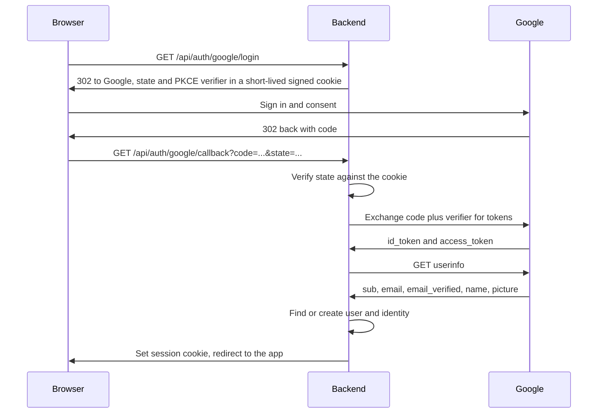

# CV Applier - v1 Plan

A web app that reads your CV, finds matching job openings for the Romanian market,
drafts tailored cover letters, and tracks every application you submit. It is built to
run on Google Cloud Platform, and to run locally under Docker Compose from the same
container image.

Status: backend skeleton and identity tables exist, nothing is deployed yet; see
[Current state](#current-state). The phase-by-phase execution checklist lives in
[BUILD.md](BUILD.md); live status for each phase is tracked in
[PROGRESS.md](PROGRESS.md); [LEARNING.md](LEARNING.md) is the running log of decisions
and the concepts behind them.

---

## 1. Scope

### In scope for v1

- Sign in with Google (OpenID Connect), with the provider layer shaped so GitHub or
  LinkedIn sign-in can be added later without reworking auth.
- CV upload in PDF and DOCX, parsed into a structured profile you can correct by hand.
- Search preferences: location, remote-only, minimum salary, extra keywords.
- Job collection from sources that publish machine-readable data (eJobs plus ATS boards).
- Deterministic ranking of postings against your profile, with a readable reason per match.
- LLM-drafted cover letter per application, editable before use.
- Application tracker: matched, drafted, submitted, interview, rejected, discarded.
- Deployment on Google Cloud Platform in `europe-west1`: the backend on Cloud Run, the
  database on Cloud SQL, uploaded CVs in Cloud Storage, the LLM on Vertex AI, and a
  nightly source refresh on Cloud Scheduler. Everything is proved locally under Docker
  Compose before anything chargeable is created.

### Explicitly out of scope for v1

- Automatic submission of applications. Nothing reaches `submitted` without your click.
- Browser automation (Playwright) and any storage of third-party logins.
- Passwords. There is no password field anywhere, so there is nothing to leak or reset.
- Paid third-party APIs. The LLM is Vertex AI, billed to the cloud project rather than
  to a key you buy yourself, so there is no separate vendor account to manage.
- LinkedIn and Indeed listings (see below for why, and when they arrive).

---

## 2. Evidence base

All of the following was verified live against the real endpoints, not assumed.

| Source | Status | What we get |
| --- | --- | --- |
| eJobs.ro | Works. Primary source | RSS and per-category sitemaps listed in its own `robots.txt`; every job page carries a full schema.org `JobPosting` in JSON-LD |
| Greenhouse | Works | `boards-api.greenhouse.io/v1/boards/{slug}/jobs` returned 632 jobs for Stripe, 891 for Databricks |
| Ashby | Works | `api.ashbyhq.com/posting-api/job-board/{slug}` returned 145 jobs with `applyUrl`, `isRemote`, `location`, `descriptionPlain` |
| Lever | Works | `api.lever.co/v0/postings/{slug}?mode=json` confirmed against `leverdemo` |
| BestJobs.eu | Phase 2 | `robots.txt` permits generic crawlers and sitemaps are published, but there is no JSON-LD; data sits in a Next.js payload, so parsing is more brittle |
| JSearch (RapidAPI) | Phase 2 | Needs a key. This is how LinkedIn and Indeed listings eventually reach us, via Google for Jobs aggregation |
| LinkedIn, Indeed (direct) | Not viable | Their APIs are partner-gated and employer-side only. Scraping them means bot detection and account risk |

Sample of the JSON-LD pulled from a live eJobs listing:

```json
{
  "title": "Area Sales Representative - Scule aschiere",
  "datePosted": "2026-09-15T11:44:26Z",
  "validThrough": "2026-10-15T00:00:00+03:00",
  "employmentType": ["FULL_TIME"],
  "hiringOrganization": { "name": "ManpowerGroup Romania" },
  "jobLocation": [{ "address": { "addressLocality": "Cluj-Napoca", "addressCountry": "RO" } }],
  "experienceRequirements": "...",
  "description": "1518 chars"
}
```

### Open question to settle early

UiPath and Bitdefender are **not** on Greenhouse or Lever. The ATS boards will likely
contribute remote-friendly roles at global companies rather than local Bucharest jobs.
First implementation phase for that adapter is to measure how many Romania-eligible roles
it actually yields. If the answer is near zero, deprioritise ATS and pull BestJobs forward.
eJobs carries v1 either way.

---

## 3. Architecture



Stack: FastAPI, SQLAlchemy and PostgreSQL 16 on the backend; Vite, React, TypeScript and
Tailwind on the frontend. PostgreSQL everywhere, behind `DATABASE_URL`: a container
locally, Cloud SQL in production. SQLite is dropped entirely rather than kept as a second
supported engine, because a database you do not run in production is a database you do
not really test. The same container image, built from `backend/Dockerfile`, runs under
Docker Compose locally and on Cloud Run, so the artefact that passes locally is the one
that deploys.

---

## 4. Cloud design

Everything lives in one GCP project in `europe-west1` (Belgium), the closest region to
the Romanian market, except Vertex AI, which is called on the `global` location because
the global endpoint is the cheapest. Google's own docs now brand Vertex AI as "Gemini
Enterprise Agent Platform"; it is the same product under a new name, and this document
calls it Vertex AI throughout.

### What each service does, and why that one

| Service | What it does here | Why not the obvious alternative |
| --- | --- | --- |
| Cloud Run, service `cv-applier` | Serves the FastAPI container. `--min-instances=0`, `--max-instances=3`, `--allow-unauthenticated` because the app does its own session-cookie auth | A Compute Engine VM bills while idle and has to be patched. GKE means operating a control plane for one container. Cloud Run scales to zero |
| Cloud SQL for PostgreSQL, instance `cv-applier-db` | The database: `db-f1-micro`, 10 GB SSD, single zone, no HA | Cloud Run instances are ephemeral and can run concurrently, so a SQLite file has no shared home. Firestore would mean giving up the joins that sections 5 and 9 are built on |
| Cloud SQL connection | The built-in Cloud SQL Auth Proxy, over a unix socket at `/cloudsql/INSTANCE_CONNECTION_NAME`. The instance keeps its default address with an empty authorized-network list, so nothing on the internet can open a connection to it | Making the instance private-IP-only would need a VPC network and, on the Cloud Run side, a connector or direct VPC egress to reach it. The proxy authenticates with IAM rather than an IP allowlist, costs nothing, and gets the same result without a VPC |
| Cloud Storage, bucket `cv-applier-uploads-PROJECT_ID` | The uploaded PDFs and DOCX files. Uniform bucket-level access, not public | The container filesystem disappears with the instance. Storing the file in a database row streams large blobs through a 0.6 GB instance for no gain |
| Vertex AI, `gemini-3.1-flash-lite` | CV extraction and cover-letter drafting. See section 10 | The Gemini API in AI Studio is the same model, a different product, and the trial credit cannot pay for it. See the billing trap below |
| Secret Manager | Holds `GOOGLE_CLIENT_SECRET` and `JWT_SECRET`. Cloud Run injects them as environment variables | Passing secrets on the deploy command leaves them in shell history and in the revision config, where anyone with read access to the service can recover them |
| Artifact Registry, `europe-west1-docker.pkg.dev/PROJECT_ID/cv-applier/backend` | Holds the container image | 0.5 GB is free and a slim image is around 200 MB, so the only rule is to keep at most two tags |
| Cloud Build | Builds the image and deploys on a push to main | Building on the laptop works, but then the only machine that can ship is that laptop |
| Cloud Scheduler, job `cv-applier-nightly` | Cron `0 5 * * *`, Europe/Bucharest, triggering the `cv-applier-refresh` Cloud Run job | A source refresh walks sitemaps at one request per second for minutes. As an HTTP endpoint it would fight the request timeout and be callable by anyone; as a job it has its own timeout and no public surface |
| Cloud Logging | Structured JSON on stdout, parsed into fields | The first 50 GiB a month is free, so there is no reason to ship logs anywhere else |

### The local stack, and how faithfully it mirrors production

`docker-compose.yml` runs three containers: the app image from `backend/Dockerfile`, a
`postgres:16` container, and `fsouza/fake-gcs-server`. The app reaches the fake bucket by
setting `STORAGE_EMULATOR_HOST=http://gcs:4443` and otherwise uses the real
`google-cloud-storage` client. One code path, a different endpoint. That is the whole
reason to run an emulator rather than write a storage-backend abstraction with two
implementations and one real use.

| Production | Locally | How close it is |
| --- | --- | --- |
| Cloud Run | The app container under Compose | Same image, same environment variables. Cloud Run adds `PORT`, TLS termination and cold starts |
| Cloud SQL for PostgreSQL 16 | `postgres:16` container | Same engine, same SQL, same migrations. Production adds the unix-socket proxy and 0.6 GB of memory |
| Cloud Storage | `fsouza/fake-gcs-server` | Same client library and the same calls |
| Vertex AI | Vertex AI | There is no emulator, so local calls are real calls against the live API. At $0.25 per million input tokens and $1.50 per million output tokens on `gemini-3.1-flash-lite`, a development call costs a fraction of a cent, which is cheaper than building a fake |
| Secret Manager | A `.env` file read by Compose | The application sees environment variables either way and cannot tell the difference |

Phases 4 to 11 create nothing chargeable. The billing clock starts at phase 12, once the
whole backend already works locally. That ordering is deliberate: the credit is a
90-day window, and days spent debugging in the cloud are days of credit spent.

### Credentials

Application Default Credentials everywhere: `gcloud auth application-default login` on
the laptop, the attached service account on Cloud Run. The SDKs pick up whichever is
present, so no code branches on environment and no key file exists to lose.

The runtime service account is `cv-applier-run@PROJECT_ID.iam.gserviceaccount.com`, with
four roles and nothing more:

- `roles/cloudsql.client`
- `roles/aiplatform.user`
- `roles/secretmanager.secretAccessor`
- `roles/storage.objectAdmin`, granted on the uploads bucket only, not project-wide

No service-account JSON key is ever downloaded. A downloaded key is a long-lived
credential in a file, and files get committed, copied between machines and never rotated.
Application Default Credentials hand out short-lived tokens instead, and there is nothing
to leak.

### Configuration

Environment variables are the only configuration mechanism. In production Cloud Run
injects the secret ones from Secret Manager before the process starts, which is why the
application never imports a Secret Manager client: it would be a second config path for
the same values.

| Variable | Locally | On Cloud Run |
| --- | --- | --- |
| `DATABASE_URL` | `postgresql+psycopg://cv:cv@db:5432/cv_applier` | The Cloud SQL unix socket under `/cloudsql/`, set directly on the service |
| `GOOGLE_CLOUD_PROJECT` | The project id | The same project id |
| `GCS_BUCKET` | The fake bucket name | `cv-applier-uploads-PROJECT_ID` |
| `STORAGE_EMULATOR_HOST` | `http://gcs:4443` | Unset |
| `VERTEX_LOCATION` | `global` | `global` |
| `VERTEX_MODEL` | `gemini-3.1-flash-lite` | `gemini-3.1-flash-lite` |
| `COOKIE_SECURE` | `false` | `true` |

`GOOGLE_CLIENT_ID`, `GOOGLE_CLIENT_SECRET`, `GOOGLE_REDIRECT_URI`, `JWT_SECRET` and
`FRONTEND_ORIGIN` all stay as they are. `OPENAI_API_KEY`, `OPENAI_BASE_URL` and
`OPENAI_MODEL` are removed.

### Details that bite on the first deploy

- Cloud Run injects `PORT` and the container must bind `0.0.0.0:$PORT`. A container
  hardcoded to 8000 fails to start with a health-check error that never mentions ports.
- Cloud Run terminates TLS and forwards the original scheme in `X-Forwarded-Proto`.
  Uvicorn needs `--proxy-headers --forwarded-allow-ips="*"`, or the app builds the OAuth
  redirect URI as `http://` and Google rejects it.
- The session cookie needs `Secure=true` in production and `false` on `http://localhost`,
  which is what `COOKIE_SECURE` exists for.
- `db-f1-micro` has 0.6 GB of memory. That is enough for one user and a few thousand
  cached postings, and would not survive a serious workload.

### Cost

| Service | Cost to us | Why |
| --- | --- | --- |
| Cloud Run | $0 | Free tier covers 2M requests, 180k vCPU-seconds and 360k GiB-seconds a month. Scale to zero means an idle app costs nothing. |
| Cloud SQL `db-f1-micro` + 10 GB SSD | about $10 a month | $0.0105 an hour for the instance plus about $1.70 a month for storage. No free tier. This is the only meaningful running cost. |
| Cloud Storage | under $0.10 a month | The 5 GB free tier is US-only, so `europe-west1` bills from the first byte at about $0.02 per GB-month. |
| Vertex AI, `gemini-3.1-flash-lite` | about $0.005 per cover letter | $0.25 per million input tokens, $1.50 per million output tokens. |
| Artifact Registry | $0 | 0.5 GB free. A slim image is around 200 MB, so keep at most two tags. |
| Secret Manager | $0 | 6 active secret versions and 10,000 access operations free per month. |
| Cloud Build | $0 | 2,500 build-minutes free per month. |
| Cloud Scheduler | $0 | 3 jobs free per month. |
| Cloud Logging | $0 | First 50 GiB per project per month. |

Total is roughly $12 a month, so about $36 across the 90-day credit window, leaving the
large majority of the $300 unspent.

The credit terms matter as much as the figures. The $300 is valid for 90 days from the
creation of the billing account, and unused credit expires, so the deadline is a calendar
one and not a spending one. When the credit runs out the trial billing account auto-closes
rather than charging the card. A $50 budget with alerts at 50%, 90% and 100% is created on
the billing account in phase 4, before any resource exists, because a budget added later
is a budget added after the mistake. The trial also blocks GPUs and TPUs, Cloud
Marketplace, quota-increase requests, Windows Server VMs and managed third-party
generative-AI models, limits Compute Engine to eight concurrent cores, and comes with no
SLAs or support. None of that constrains this app.

### The billing trap

The credit cannot pay for the Gemini API in Google AI Studio. It can pay for Vertex AI.
They serve the same models and are two different products with two different billing
paths, and picking the wrong one means a card charge next to $300 of unspent credit. Every
model call in this project goes through Vertex AI. This is the single most important
gotcha in the integration, which is why it appears here, in section 10, and in
`docs/llm.md`.

---

## 5. Data model

Defined in [backend/app/models.py](backend/app/models.py).

- `users` - identity-independent account: email, display name, avatar URL, timestamps.
  No password column.
- `identities` - one row per external login linked to a user: `provider`, `subject`
  (the provider's stable user id), unique on `(provider, subject)`. This is what lets
  GitHub or LinkedIn sign-in be added later without touching `users`.
- `profiles` - one row per user, holding both the CV-derived fields (titles, skills,
  years of experience, summary) and the search preferences (preferred locations,
  remote-only, minimum salary). One table because there is exactly one of each per user.
- `jobs` - shared cache of postings, unique on `(source, external_id)`, so two users
  searching the same day do not trigger a refetch.
- `applications` - the join between a user and a job. This is where the review queue lives,
  carrying status, score, match reason, cover letter, notes and timestamps.

The tables themselves are unchanged. What changed is underneath them: the database is
PostgreSQL 16, and Alembic owns the schema. That supersedes the earlier decision to call
`Base.metadata.create_all` on startup and delete the database file whenever the schema
moved.

Two things forced it, and neither existed before the cloud decision. The data now lives in
a managed database that cannot casually be deleted, so "drop it and restart" stops being a
development convenience and becomes data loss. And more than one Cloud Run instance can
cold-start at the same time, so `create_all` becomes a race: two processes issuing the same
DDL against the same database, with the loser erroring on startup. Alembic arrives in
phase 5, before anything is deployed, so the first migration is written against the local
Postgres container rather than against production.

### Application lifecycle



The transition to `submitted` is only ever triggered by an explicit user action. This is
the core design commitment of the product.

---

## 6. Authentication

Google sign-in over OpenID Connect, using the authorization code flow with PKCE. The
endpoints below come from Google's live discovery document, checked today:

- Authorization: `https://accounts.google.com/o/oauth2/v2/auth`
- Token: `https://oauth2.googleapis.com/token`
- Userinfo: `https://openidconnect.googleapis.com/v1/userinfo`
- Scopes: `openid email profile`, and `code_challenge_method=S256` is supported



Design notes:

- No Google tokens are stored. We need Google only to establish who you are at login;
  afterwards the app runs on its own session cookie, so there is nothing long-lived to
  protect or refresh.
- The session is our own JWT in an httpOnly, SameSite=Lax cookie, signed with `JWT_SECRET`.
  `Secure` comes from `COOKIE_SECURE`: off on `http://localhost`, on in production.
- `state` and the PKCE verifier live in a short-lived signed cookie rather than a
  server-side session store, which keeps the backend stateless. That matters more now:
  Cloud Run can serve two consecutive requests from two different instances.
- Provider extensibility is a dict of provider configs plus a claim-mapping function, so
  adding GitHub is a new entry and a small mapper, not a new auth system.
- Account linking: if a login arrives for an email that already exists, we attach a new
  identity row to that user, but only when the provider reports the email as verified.
  Linking on an unverified email is an account-takeover path.
- Dependency effect: `bcrypt` comes out of the requirements, and nothing new goes in;
  `httpx` and `pyjwt` are already there.

Local setup needed from you: a Google Cloud OAuth client (Web application) with redirect
URI `http://localhost:8000/api/auth/google/callback`, providing `GOOGLE_CLIENT_ID` and
`GOOGLE_CLIENT_SECRET`. Phase 13 adds the Cloud Run URL to the same client as a second
authorized redirect URI, so one client serves both environments.

One clarification, since the names collide: LinkedIn sign-in is OpenID Connect and is
perfectly allowed. It has nothing to do with LinkedIn's jobs API, and adding it would not
give us access to a single job posting.

---

## 7. Job sources

Every source implements one small interface, so adding BestJobs or JSearch later means
one new file and a registry entry.

```python
@dataclass
class Posting:
    source: str
    external_id: str
    url: str
    apply_url: str
    title: str
    company: str
    locations: list[str]
    remote: bool
    employment_type: str
    description: str
    posted_at: datetime | None


class JobSource(Protocol):
    name: str
    def fetch(self, profile: Profile, limit: int) -> list[Posting]: ...
```

### eJobs adapter

- Discovery: category sitemaps such as `sitemap-listings-it-software.xml` and
  `sitemap-listings-internet-ecommerce.xml`, chosen from the profile, plus
  `rss-listings.xml` for freshness.
- Detail: fetch the page, parse the JSON-LD `@graph`, take the `JobPosting` node.
- Field mapping: `title`, `description`, `employmentType`, `hiringOrganization.name`,
  `jobLocation[].address.addressLocality`, `datePosted`, `validThrough`.
- Politeness: one request per second, identifying User-Agent, and a seen-URL set so each
  run only fetches pages it has not seen.
- Remote detection needs Romanian keywords as well as English: listings say "de acasa"
  and "telemunca" as often as "remote".

### ATS adapter

One generic fetcher with three response mappings, driven by a watchlist of
`(provider, slug)` pairs in a config file. Ashby returns the cleanest data of the three,
including a direct `applyUrl`.

Both adapters run in the request path during development and in the `cv-applier-refresh`
Cloud Run job once deployed. A run that walks sitemaps at one request per second takes
minutes, which is why the nightly refresh is a job rather than an endpoint.

---

## 8. CV parsing and profile

The upload endpoint writes the file to the Cloud Storage bucket first, under a per-user
key, through `backend/app/storage.py`. Locally that is `fake-gcs-server` and in production
the real bucket, with the same client either way. Keeping the original costs a fraction of
a cent a month and means a later parser fix can be re-run over what you actually uploaded
instead of asking you to upload it again.

`pdfplumber` for PDF and `python-docx` for DOCX then produce plain text into
`profiles.cv_text`. That text goes through one Vertex AI call returning structured JSON:
name, headline, titles, skills, years of experience, summary.

The parsed profile is fully editable in the UI. LLM extraction will get things wrong, and
the fix is letting you correct it rather than engineering around it.

---

## 9. Matching

Deterministic scoring with no LLM cost per posting, so a run over thousands of jobs is
free and instant.

1. Hard filters: location must intersect your preferred locations or the job must be
   remote, and the posting must not be expired.
2. Score from 0 to 100: title overlap against your known titles, skills overlap against
   the description, and a recency boost.
3. Every match stores a readable reason, for example "matches 7 of your skills: Python,
   FastAPI, Docker...", so the ranking is never a black box.

Text is normalised for Romanian diacritics, and a small synonym map handles the bilingual
reality of the market, where the same role is posted as "Dezvoltator" or "Developer".

---

## 10. LLM module

One module, `llm.py`, with two functions: `extract_profile(cv_text)` and
`draft_cover_letter(profile, job)`. Both call Vertex AI through the `google-genai` SDK:

```python
from google import genai

client = genai.Client(
    vertexai=True,
    project=settings.google_cloud_project,
    location=settings.vertex_location,   # global
)
response = client.models.generate_content(
    model=settings.vertex_model,         # gemini-3.1-flash-lite
    contents=prompt,
)
```

The model is `gemini-3.1-flash-lite`. It was released on 2026-05-07 and is supported until
at least 2027-05-07, so it comfortably outlives the credit window, and at $0.25 per million
input tokens and $1.50 per million output tokens a cover letter costs about half a cent.
The location is `global` because non-global endpoints cost 10% more for the same model.

Vertex AI rather than the Gemini API in AI Studio, for two reasons. The trial credit pays
for Vertex AI and cannot pay for AI Studio, which would turn a free project into a card
charge. And Vertex AI authenticates with the same Application Default Credentials as Cloud
SQL and Cloud Storage, so there is no API key in this project at all.

That also removes a design that used to be here. There is no provider abstraction and no
OpenAI-compatible base URL, because there is one model behind one SDK, and `openai` comes
out of the requirements. There is no keyless fallback either: credentials now come from the
cloud project rather than from a key you may or may not have pasted into `.env`, so a
degraded keyword-matching path would be dead code guarding a case that cannot happen. If
Vertex AI is unreachable the call fails and the endpoint says so.

The prompts, the language-of-the-posting rule for cover letters and the model choice are
documented in `docs/llm.md`.

---

## 11. API surface

| Method and path | Purpose |
| --- | --- |
| `GET /api/auth/{provider}/login` | Redirect to the provider (v1: `google`) |
| `GET /api/auth/{provider}/callback` | Verify state, exchange code, set session cookie |
| `GET /api/auth/me` | Current user, or 401 |
| `POST /api/auth/logout` | Clear the session cookie |
| `GET`, `PATCH /api/profile` | Read and correct the parsed profile and preferences |
| `POST /api/profile/cv` | Upload PDF or DOCX to the bucket, parse, populate profile |
| `POST /api/jobs/refresh` | Run the enabled sources, upsert into `jobs` |
| `GET /api/matches` | Ranked matches with score and reason |
| `POST /api/applications` | Create from a match, optionally drafting the letter |
| `PATCH /api/applications/{id}` | Edit letter, change status, add notes |
| `GET /api/applications` | The tracker, filterable by status |

---

## 12. Frontend

Vite with React and TypeScript, Tailwind for styling, TanStack Query for server state,
React Router for navigation. Four screens:

- Sign in: a single "Continue with Google" button.
- Profile: CV upload, editable parsed fields, search preferences.
- Matches: ranked cards showing score and reason, with draft-letter and dismiss actions.
- Tracker: table grouped by status, with notes and dates.

No component library. A handful of hand-rolled Tailwind components is less machinery than
wiring up a generator, consistent with
[.cursor/rules/coding-style.mdc](.cursor/rules/coding-style.mdc).

The compiled bundle ships inside the backend image rather than on separate hosting: phase
16 turns `backend/Dockerfile` into a multi-stage build and the backend serves the static
files. One image, one deploy, one origin, and no CORS in production.

---

## 13. Repository layout

```
backend/
  Dockerfile                    one image, Compose locally and Cloud Run in production
  requirements.txt              exists, drop bcrypt and openai
  alembic.ini
  alembic/versions/             schema migrations, replacing create_all
  app/
    config.py  db.py            exist
    models.py                   users and identities match the auth design
    main.py  session.py  oauth.py  llm.py  matching.py  cv.py
    storage.py                  Cloud Storage reads and writes
    sources/base.py  ejobs.py  ats.py  registry.py
    routers/auth.py  profile.py  jobs.py  applications.py
frontend/
  src/pages/  src/components/  src/api.ts
docker-compose.yml              app, postgres 16, fake-gcs-server
cloudbuild.yaml                 build, push and deploy on a push to main
```

---

## 14. Build order

Twenty-one phases in four parts, each leaving something runnable. The granular version,
with verification steps for each item, is in [BUILD.md](BUILD.md); check
[PROGRESS.md](PROGRESS.md) for current status and [LEARNING.md](LEARNING.md) for why each
decision was made.

**Part 1 - Backend, running locally**

1. Application skeleton (done).
2. Data model for identity (done).
3. Google sign-in (done).
4. GCP project and guardrails: the budget alert first, then the APIs, Application Default
   Credentials and the runtime service account. Nothing chargeable is created, and a
   single Vertex AI call costing a fraction of a cent proves it works.
5. Local cloud-parity stack: `backend/Dockerfile`, `docker-compose.yml` with Postgres 16
   and `fake-gcs-server`, off SQLite, Alembic for the schema. Phases 1 to 3 must still pass.
6. CV upload and profile: the file goes to Cloud Storage, the extraction call to Vertex AI.
7. eJobs source.
8. ATS source, plus the Romania-coverage measurement described in section 2.
9. Matching.
10. Applications API.
11. Cover letters on Vertex AI, with the language-of-the-posting rule.

**Part 2 - Running on GCP**

12. Data plane: the Cloud SQL instance, the bucket, secrets into Secret Manager, and the
    Alembic migration run against Cloud SQL. The billing clock starts here.
13. First deploy: Artifact Registry, build and push, the Cloud Run service with its
    service account, Cloud SQL connection and secrets attached, the Cloud Run URL added as
    a second redirect URI, `COOKIE_SECURE=true`, and a real Google sign-in on the live URL.
14. Scheduled refresh: the `cv-applier-refresh` job and the `cv-applier-nightly` trigger.
15. Deploy on push: a Cloud Build trigger on main.

**Part 3 - Frontend**

16. Shell and sign-in, and the multi-stage Dockerfile that ships the built frontend.
17. Profile screen.
18. Matches screen.
19. Tracker screen.
20. Polish.

**Part 4 - Operating it**

21. Observability and cost hygiene: structured JSON logging that Cloud Logging parses into
    fields, a look at the real credit burn-down, a review of the budget alert, and a
    written teardown checklist for when the credit runs out.

Rough effort: about a day and a half for the backend, roughly another day for the cloud
phases, and about a day for the frontend.

---

## 15. Current state

- [backend/app/main.py](backend/app/main.py) - FastAPI app, CORS, `/api/health`,
  `create_all` on startup.
- [backend/app/config.py](backend/app/config.py) - settings from environment, including
  Google and frontend origin.
- [backend/app/db.py](backend/app/db.py) - SQLAlchemy engine and session.
- [backend/app/session.py](backend/app/session.py) and
  [backend/app/oauth.py](backend/app/oauth.py) - Google OpenID Connect with PKCE and
  a JWT session cookie. See [docs/auth.md](docs/auth.md).
- [backend/app/models.py](backend/app/models.py) - tables as in section 5. `users` has
  no password column. `identities` is unique on `(provider, subject)`.
- [backend/requirements.txt](backend/requirements.txt) - `bcrypt` removed. It changes
  again in phase 5: `openai` out, `google-genai`, `google-cloud-storage`,
  `psycopg[binary]` and `alembic` in.

CV parsing, sources, matching, and the frontend are not built yet. Nothing is
containerised and nothing is deployed.

---

## 16. Risks and later phases

- eJobs could change its markup. JSON-LD is the most stable part of any job page because
  Google consumes it, and any breakage is confined to one adapter.
- Politeness matters. This is personal-scale usage at one request per second. If it ever
  became a hosted product, the sourcing question reopens.
- Without JSearch, LinkedIn and Indeed listings will not appear in v1.
- Google OAuth in "testing" mode limits sign-in to test users you list. Publishing the
  consent screen is a separate step if other people will use this.
- The credit expires 90 days after the billing account is created, whether or not it has
  been spent. The binding constraint on this project is the calendar, not the $300.
- The Cloud SQL instance bills whether or not anyone uses the app, and it is the only
  thing here that does. Everything else scales to zero. Stopping the instance stops the
  compute charge but still bills for storage.
- Cloud Run cold starts are visible on the first request after an idle period, because
  `--min-instances=0`. Keeping an instance warm would add a standing charge to an app that
  is idle most of the day, so the latency is the accepted trade.
- When the credit is gone the trial billing account auto-closes rather than charging the
  card. That is a real safety net against a runaway bill, and it also means the app simply
  stops serving. Phase 21 writes the teardown checklist so that day is a decision rather
  than a surprise.

Later phases, in the order they make sense:

1. BestJobs adapter, added to the nightly refresh alongside eJobs and the ATS boards.
2. JSearch key, bringing LinkedIn and Indeed listings into the results.
3. Playwright auto-fill for ATS forms, which need no login, keeping the confirm step.
4. Anything touching LinkedIn Easy Apply would have to be a browser extension running in
   your own session, never server-side, and carries account-restriction risk.
